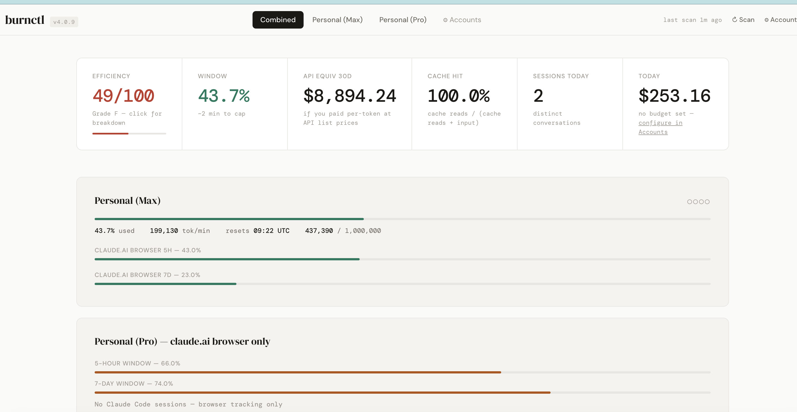

> ### ⚠️ Security Notice — git history rewritten (2026-04-22)
>
> **What happened:** On 2026-04-11 (initial commit), a local `data/usage.db` file was unintentionally committed before the `.gitignore` was finalized. It was removed from `HEAD` on 2026-04-13, but the blob remained in git history.
>
> **What it contained:** test-run session metadata, a dashboard key, a sync token, an OpenRouter API key, and two claude.ai session cookies. All credentials have been rotated; the old values are confirmed invalid (HTTP 403 when tested against claude.ai/api/organizations).
>
> **What was fixed:** On 2026-04-22, the blob was purged from all git history via `git filter-repo`, and this repository was force-pushed to overwrite the remote.
>
> **What you need to do:** If you cloned burnctl before 2026-04-22, your clone has divergent history. Please re-clone:
>
> ```bash
> cd .. && rm -rf burnctl && git clone https://github.com/pnjegan/burnctl.git
> ```
>
> A full incident writeup is planned for a LinkedIn post. This repository's own 6-dimension self-audit (plus a 7th independent meta-review) caught the issue — documented in `audit-reports/2026-04-22-*.md`.

<div align="center">

<br><br>

# burnctl

**Real-time burn-rate monitor for Claude Code.**

Tokens/min, $/hr, retry-loop detection, waste-pattern analysis — local-only,
zero pip dependencies.

[](https://www.npmjs.com/package/burnctl)
[](LICENSE)
[]()
[]()

```
npx burnctl@latest audit
```

</div>

> Renamed and rebooted from `claudash` 3.x. Same engine; sharper focus.



---

## What it does

```bash
burnctl statusline
# ⚡ 142t/min | $0.84/hr | 5hr: 12.3k tok / $0.41 | Loop: ✓
```

Reads the JSONL files Claude Code writes locally to `~/.claude/projects/`,
parses sessions into a SQLite DB, and surfaces:

- **Live burn rate** — tokens/min and $/min observed in the last 5 minutes
- **5-hour rolling block** — observed token + cost totals (no quota guess; see note below)
- **Retry-loop detection** — flags any project firing 5+ sessions in 10 min with avg gap < 60s
- **Waste-pattern analysis** — repeated reads, stuck loops, late compactions, cost outliers (22 detectors)
- **Subagent cost attribution** — which projects are spawning expensive background agents
- **Session startup overhead** — tokens burned before you type a word (CLAUDE.md + MCP + tools)
- **Peak hour drain** — Mon-Fri 13:00-19:00 UTC, session limits burn faster
- **Fix tracker** — capture a baseline, apply a CLAUDE.md rule, re-measure outcomes
- **Web dashboard** — http://localhost:8080 with charts + per-project breakdown

> ccusage shows the score. burnctl shows what's moving it.

---

## Real numbers (from my own sessions)

> These are detection counts from burnctl running on the maintainer's own Claude Code history. Your numbers will depend on your usage patterns.

| Metric | Value |
|---|---|
| Sessions analyzed | 200 |
| Retry loops found | 214 occurrences, 47,948 tokens |
| Dead-end spirals | 30 occurrences, 30,000 tokens |
| Subagent spend | 43% of total budget (invisible until now) |
| Session overhead | 151,175 tokens before first message (grew 275% in 5 weeks) |
| Sessions hitting compaction | 62% |
| Fixes applied | 9 |
| Fixes improving | 7 |

---

### A note on rate-limit math

Anthropic does **not** publish per-plan token-budget limits for the 5-hour
block. burnctl deliberately does not invent an "X% of limit used" number,
because making one up would mislead you. We show observed local burn and
let you apply your own intuition.

---

## Supported scenarios

burnctl is under active development. This is the honest state of what works today.

**Works well:**
- macOS with Claude Code, reading `~/.claude/projects/`
- Linux with Claude Code, reading `~/.claude/projects/`
- Local dashboard on `http://localhost:8080`
- Fix tracking: record a fix, measure its pattern-scoped impact over days, re-measure

**Works, less battle-tested:**
- Windows via WSL2 (scanner includes the path, limited user reports)
- Windows native (scanner has an AppData path, not end-to-end verified)
- Remote compute setup (see Special Note below — works for the maintainer, documented for similar setups)
- claude.ai browser session tracking (depends on endpoints that are not a documented API; may break without notice)

**Not yet supported:**
- Claude Desktop app (different usage data path)
- Docker / Codespaces / Gitpod containers
- Firefox / Safari / Edge / Brave / Arc for direct browser cookie sync (Chrome and Vivaldi only; `oauth_sync.py` works regardless of browser but requires Claude Code to be installed)
- Standalone Anthropic API consumption tracking (use ccusage's API companion or Anthropic's billing dashboard)

If you hit an unsupported scenario, file an issue.

---

## vs ccusage / claude-hud

|                              | ccusage | claude-hud | burnctl |
|------------------------------|:-------:|:----------:|:-------:|
| Token + cost reports         |   ✅    |     —      |   ✅    |
| 5-hour block totals (observed) |   ✅    |     —      |   ✅    |
| Live tokens/min + $/hr       |   ❌    |     ✅     |   ✅    |
| In-session context HUD       |   ❌    |     ✅     |   ❌    |
| Retry-loop detection         |   ❌    |     ❌     |   ✅    |
| Web dashboard                |   ❌    |     ❌     |   ✅    |
| Waste-pattern detection (22 rules) |   ❌    |     ❌     |   ✅    |
| Fix tracker (pattern-scoped observation)   |   ❌    |     ❌     |   ✅    |
| Statusline hook output       |   ❌    |     ❌     |   ✅    |
| Inferred ETA to limit        |   —    |     —      |   —    |

ccusage is the scoreboard. claude-hud is the real-time in-session context
monitor. burnctl is the post-session intelligence and fix layer.
(Neither tool can show a real ETA-to-limit because Anthropic does not publish the limit. ccusage estimates it; we don't.)

---

## Install

### npx (no install)
```bash
npx burnctl@latest
```

### npm global
```bash
npm install -g burnctl
burnctl dashboard
```

### Git clone
```bash
git clone https://github.com/pnjegan/burnctl.git
cd burnctl
python3 cli.py dashboard
```

---

## Special Note: Remote compute setup

If you run Claude Code on a remote machine (VPS, EC2, or other cloud instance) and SSH in from a laptop, install burnctl on the remote where Claude Code runs — not on your laptop. Your JSONL files live on the remote, and burnctl reads them there.

Access the dashboard by tunneling port 8080 back to your laptop:

```bash
ssh -L 8080:localhost:8080 your-remote
# then open http://localhost:8080 in a browser on your laptop
```

**Optional: claude.ai browser session sync.**

If you also use claude.ai in a browser (separate from Claude Code) and want that usage in the same dashboard, burnctl ships a sync tool that pushes browser session data from your laptop to your remote burnctl instance.

The recommended cross-platform option is `tools/oauth_sync.py`. It uses Claude Code's existing OAuth access token — not scraped browser cookies — and works on macOS, Linux, and (untested) Windows:

```bash
# On your laptop, edit VPS_IP and SYNC_TOKEN at the top of the file, then:
python3 tools/oauth_sync.py
```

A macOS-only alternative (`tools/mac-sync.py`) reads Chrome/Vivaldi cookie stores directly via Keychain. Use it only if `oauth_sync.py` doesn't fit your setup.

**Caveats for this setup:**

- Sync pushes data over plain HTTP. Only safe behind an SSH tunnel or on a private network. Do not expose the sync endpoint to the public internet.
- The sync token is a bearer credential. If it leaks, rotate it via `burnctl keys --rotate` and update your sync config.
- Browser session sync relies on undocumented claude.ai endpoints. It works today, but may break when Anthropic updates their web app.

---

## Requirements

| Requirement | Why | Check |
|---|---|---|
| Claude Code | burnctl reads its session files | `claude --version` |
| Python 3.8+ | Engine is Python (no pip deps) | `python3 --version` |
| Node.js 16+ | Required only for npx / npm install | `node --version` |

Run at least one Claude Code session before launching burnctl — sessions are
stored in:
- macOS / Linux: `~/.claude/projects/`
- Windows (WSL2): `/mnt/c/Users/<username>/AppData/Roaming/Claude/projects/`

---

## Commands

### No setup required (work immediately)

```bash
burnctl audit [proj]    # JSONL waste-pattern audit (loops, dead-ends, rereads)
burnctl peak-hours      # Mon-Fri 13:00-19:00 UTC peak status (drain context)
burnctl version-check   # flag known-bad Claude Code versions (2.1.69-2.1.89)
burnctl resume-audit    # detect cache-bust signals (5m TTL, low hit rate)
```

### Requires scan first (`burnctl scan` from your project dir)

```bash
burnctl dashboard       # web UI on http://localhost:8080
burnctl burnrate        # tokens/min, $/min, $/hr (last 5 min)
burnctl loops           # show retry-loop activity in last 10 min
burnctl block           # 5-hour rolling block totals
burnctl subagent-audit  # subagent cost split per project
burnctl overhead-audit  # session startup overhead trend
burnctl compact-audit   # compaction rate per project
burnctl variance [proj] # per-project cost variance with root-cause diagnosis
burnctl statusline      # one-line output for Claude Code statusline hook
burnctl scan            # one-shot scan of new JSONL sessions
burnctl waste           # waste-pattern detector summary
burnctl backup          # hot-copy DB + JSON fixes export
```

### The fix loop

```bash
burnctl fix apply 3     # auto-write fix to ~/.claude/CLAUDE.md (confirm with y)
burnctl measure --auto  # measure all pending fixes
burnctl fixes           # list recorded fixes + verdict
burnctl fix-scoreboard  # applied fixes + observed before/after per pattern
```

Closed loop, no copy-paste:

```
burnctl audit          → finds waste in your sessions
burnctl fix apply 3    → writes CLAUDE.md rule automatically
[work normally 2-3 days]
burnctl fix-scoreboard → shows applied fixes + observed before/after per pattern
```

Full command list: `burnctl --help`.

---

## Statusline hook

Add to `~/.claude/settings.json` (or per-project `.claude/settings.json`):

```json
{
  "statusLine": {
    "type": "command",
    "command": "burnctl statusline"
  }
}
```

Then your Claude Code statusline shows live burn whenever you're working.

---

## Privacy

**Local-only setup (most users):**
Nothing leaves your machine. burnctl reads files from `~/.claude/projects/`, stores analysis in a local SQLite database at `data/usage.db`, and serves a dashboard on localhost. Outbound network traffic is limited to npm version checks.

**Remote compute setup:**
Your JSONL data stays on your remote. If you run `oauth_sync.py` or `mac-sync.py` (see Special Note above), those tools push claude.ai session data from your laptop to your remote burnctl instance. This is the only data that crosses machines, and only when you opt into running the sync tool.

**Session credentials:**
The sync flow stores either a session key (for cookie-based sync) or an OAuth access token (for `oauth_sync.py`) in the burnctl database on your remote. These grant access to claude.ai on your behalf — treat the burnctl database as sensitive. Rotate credentials if the database or sync token leaks.

For team / cloud deployment guidance: [SECURITY.md](SECURITY.md).

---

## Troubleshooting

**Dashboard shows no data**
Run `burnctl scan`. Confirm `~/.claude/projects/` contains `.jsonl` files.

**Port 8080 already in use**
```bash
burnctl dashboard --port 9090
```

**Python not found**
```bash
brew install python@3.11           # macOS
sudo apt install python3            # Ubuntu / Debian
```

**WSL2 can't find Windows sessions**
burnctl looks at `/mnt/c/Users/<username>/AppData/Roaming/Claude/projects/`.
Confirm the path with `ls /mnt/c/Users/`.

**Upgrading from `@jeganwrites/claudash` 3.x**
- Existing DB at `data/usage.db` keeps working unchanged
- Env vars: `BURNCTL_VPS_IP`, `BURNCTL_VPS_PORT`, `BURNCTL_BACKUP_DIR`
  (legacy `CLAUDASH_*` variants still honored)
- `/tmp/claudash.pid` → `/tmp/burnctl.pid` — kill the old daemon if it's still running
- MCP server key in `~/.claude/settings.json` renames from `"claudash"` to `"burnctl"`
- Backup default path stays `/root/backups/claudash` so existing rclone offsite
  sync keeps working through the rebrand

---

## Contributing

PRs welcome. Especially:
- Native Windows support (without WSL2)
- More waste-pattern detectors
- Statusline output formats for other shells / editors

```bash
git clone https://github.com/pnjegan/burnctl.git
cd burnctl
python3 cli.py dashboard   # no install needed
```

See [CONTRIBUTING.md](CONTRIBUTING.md) for full guidelines.

---

## Sources and attribution

Peak hour timing (Mon-Fri 13:00-19:00 UTC):
Thariq Shihipar (Anthropic), X post March 26 2026, confirmed by GitHub issue #41930

Bad version range (v2.1.69-v2.1.89):
GitHub issues #34629, #38335, #42749. Safe target: v2.1.91+

Cache TTL regression:
github.com/cnighswonger/claude-code-cache-fix, GitHub issue #46829

250K wasted API calls/day from retry loops:
Anthropic internal data, Claude Code source (autoCompact.ts, March 2026)

---

## License

MIT — fork it, ship it, build on it.

Built by [pnjegan](https://github.com/pnjegan).

---

*All data stays on your machine. Zero pip dependencies. One command install.*
